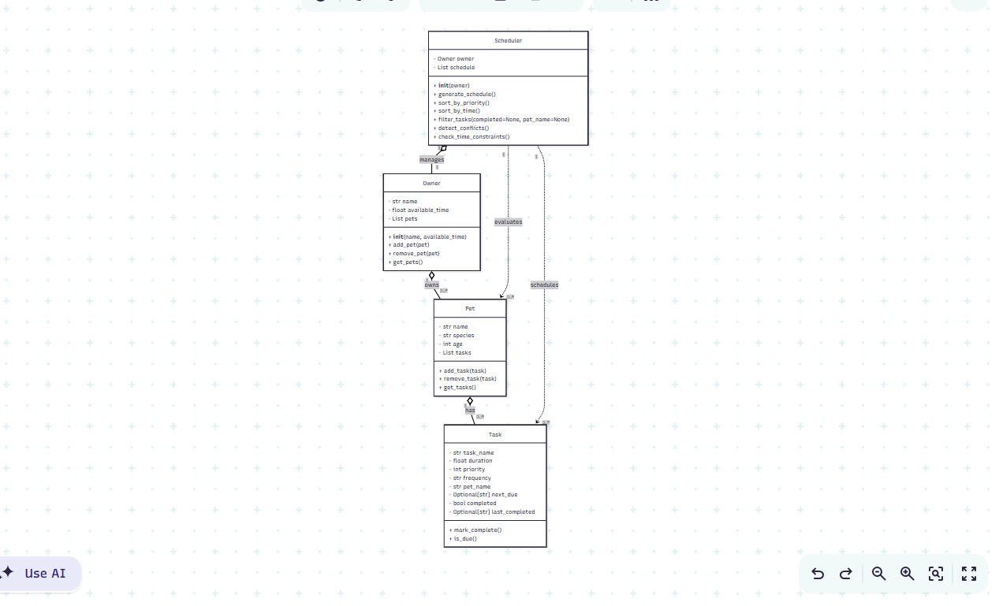

# PawPal+ (Module 2 Project)

You are building **PawPal+**, a Streamlit app that helps a pet owner plan care tasks for their pet.

## Scenario

A busy pet owner needs help staying consistent with pet care. They want an assistant that can:

- Track pet care tasks (walks, feeding, meds, enrichment, grooming, etc.)
- Consider constraints (time available, priority, owner preferences)
- Produce a daily plan and explain why it chose that plan

Your job is to design the system first (UML), then implement the logic in Python, then connect it to the Streamlit UI.

## What you will build

Your final app should:

- Let a user enter basic owner + pet info
- Let a user add/edit tasks (duration + priority at minimum)
- Generate a daily schedule/plan based on constraints and priorities
- Display the plan clearly (and ideally explain the reasoning)
- Include tests for the most important scheduling behaviors

## Getting started

### Setup

```bash
python -m venv .venv
source .venv/bin/activate  # Windows: .venv\Scripts\activate
pip install -r requirements.txt
```

### Suggested workflow

1. Read the scenario carefully and identify requirements and edge cases.
2. Draft a UML diagram (classes, attributes, methods, relationships).
3. Convert UML into Python class stubs (no logic yet).
4. Implement scheduling logic in small increments.
5. Add tests to verify key behaviors.
6. Connect your logic to the Streamlit UI in `app.py`.
7. Refine UML so it matches what you actually built.

## Testing PawPal+

Run the test suite with:
```bash
python -m pytest
```

### What the tests cover:
- Task completion and status tracking
- Adding tasks to pets
- Scheduler priority and time constraints
- Duplicate task prevention
- Sorting tasks by duration
- Recurring task next_due date calculation
- Conflict detection for same-pet same-day tasks

### Confidence Level: ⭐⭐⭐⭐ (4/5)
All 7 tests pass. The system reliably handles core scheduling 
behaviors. Edge cases like overlapping time windows and multi-day 
scheduling would need additional testing.

## ✨ Features
- Owner and pet management
- Task scheduling by priority and available time
- Sorting tasks by duration
- Filtering tasks by completion status
- Recurring task support (daily/weekly next_due dates)
- Conflict detection for same-pet same-day tasks

## 🖥️ Smarter Scheduling
PawPal+ now includes four algorithmic scheduling enhancements:
1. Priority-aware task selection for higher-impact pet care actions.
2. Available time constraints that ensure the plan fits the owner’s schedule.
3. Duration-based sorting to efficiently allocate shorter tasks when needed.
4. Recurring and conflict checks to keep plans consistent and avoid duplicate same-day entries per pet.

## 📸 Demo


## 🏗️ System Architecture
